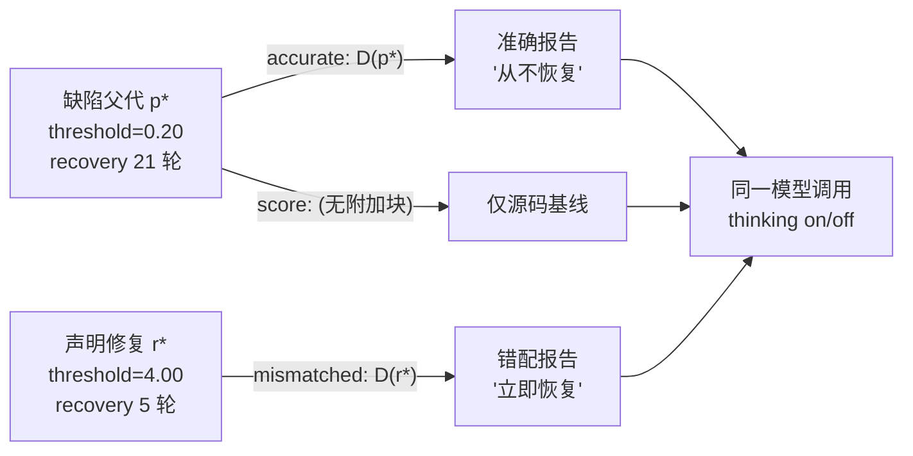

# Known-Defect Positive Control：实验报告

**日期**：2026-09-30
**对应审稿意见**：[`审稿意见.md`](../../审稿意见.md) 第 3 条（尚未证明数值报告本身是可利用的诊断）
**代码**：[`experiments/direct_reciprocity/positive_control.py`](../../experiments/direct_reciprocity/positive_control.py)
**数据**：`results/positive_control_20260929/`（OFF）、`results/positive_control_thinking_20260930/`（Thinking）

本报告是该实验的**唯一文档**：既记录事前设计（§2–§3），也记录事后结果（§4–§6）与
已声明的局限（§7、§9）。此前的英文设计稿 `POSITIVE_CONTROL.md` 内容已全部合并入本文件，
已于 2026-09-30 删除，以避免两份同内容文档并存。

---

## 0. 结论摘要

| # | 结论 | 证据强度 |
|---|---|---|
| 1 | 报告通道**是活的、被读的**：有报告的轨迹 42/42 提到全部探测名，无报告的 0/21。**H3（模型忽略报告）被推翻** | **确定性**（假阳性下限恰为 0） |
| 2 | 正确匹配反馈在收益上**没有**优于错配反馈（两种生成模式皆是） | 测量（区间跨零） |
| 3 | 在操纵终于有功效的地方，符号是**负的**：accurate − mismatched `repair_gain` = −5.01，CI 不含零 | 测量（n=4，单一策略族） |
| 4 | 报告被当作**目标规范**而非自身诊断使用 | **假说**（轨迹引文 + 引用数不对称） |
| 5 | 本对照按现有设计**无法**证明"正确反馈有用"——因为错配臂收到的正是 $r^*$ 自己的报告，模仿它即自动最大化指标 | 设计缺陷（声明） |

**一句话**：报告被读了，但读到的内容被当作"要超越的目标"，而错配报告恰好描述了一个健康策略——于是**错误反馈成了更好的提示**。

### 本报告撤回的两条先前推断

| 先前推断 | 为什么撤回 |
|---|---|
| "缺陷可从源码推断，所以模型忽略了报告" | 依据是**读生成代码**和 `score ≈ accurate` 的结果模式。这不测量内部过程。thinking 臂的轨迹显示模型读了报告（21/21）并正确诊断了缺陷。 |
| "正确反馈反而有害"（把 −5.01 直接读成机制） | `repair_gain` 与 mismatched 臂提供的报告**按构造一致**（§7）。−5.01 至少部分是度量定义的产物，不能直接读作机制。 |

两条撤回的共同教训：**"结果模式看起来像什么"不等于"过程是什么"**。前者需要轨迹测量才能升级为结论。

---

## 1. 为什么需要这个对照

主实验的 null result 是 $Q_{\text{Accurate}} \approx Q_{\text{Mismatched}}$。它同时兼容三种解释：

$$
\begin{aligned}
H_1 &: \text{模型用了报告，但不需要精确匹配}\\
H_2 &: \text{模型只用了与源码冗余的报告内容}\\
H_3 &: \text{模型基本忽略报告，靠源码和成绩改}
\end{aligned}
$$

**Score 条件无法区分它们。** Score 是"报告通道 vs 无报告"的基线，测的是通道带宽；而 $H_3$ 问的是"报告有没有被读进去"。只有在一个**已知正确答案**的场景里，才可能把"可利用性"变成可证伪的检验。

### 与 Score 条件的本质差异

| 判断 | Score 能做吗 | 需要 positive control |
|---|---|---|
| 报告通道ning man I am finally vs 无报告 | ✅ 间接 | — |
| 报告**正确性**是否有用 | ❌ | ✅ |
| 排除"模型根本没读报告"（$H_3$） | ❌ | ✅ |
| 模型能否做出**定向**正确修复 | ❌ | ✅ |

---

## 2. 设计

### 2.1 三个条件，共享同一个缺陷父代



| 条件 | 附加块 | 作用 |
|---|---|---|
| `accurate` | $D(p^*)$，父代自身的测量报告 | 阳性对照臂 |
| `mismatched` | $D(r^*)$，**声明修复**的报告 | 错误报告对照 |
| `score` | 无 | 仅源码基线 |

用**修复后的兄弟策略**当供体，得到最紧凑的错配：代码形态相同、报告格式相同，只有缺陷相关的数值不同。两个块**各 504 个 cl100k token**，长度完全一致。

### 2.2 为什么缺陷不能从源码读出来

两个策略族都把缺陷表达为**不透明的数值常数**，其行为后果必须模拟才能评估：

```
weighted(window, decay, threshold)
    d = Σ decay^k · 1[对手背叛]
    return 'D' if d > threshold else 'C'

window(window, needed)
    return 'D' if (最近 window 轮中背叛数) >= needed else 'C'
```

`threshold = 0.20` 与 `threshold = 4.00` 产生 21 轮与 5 轮的恢复时间差；源码本身不说明这一点。`score` 臂测的正是"源码单独能提供多少"。

---

## 3. 离线验证（0 次 LLM 调用）

扫描 **81 组参数**，在冻结的 F 探针与 H 面板上测量。仅当声明修复满足以下两条时才保留配对：

1. 大幅移动缺陷轴；
2. **不降低** H 收益（`h_tolerance = 0.005`）。

7 对通过全精度验证：

| id | 轴 | 缺陷 | 修复 | 缺陷 → 修复 |
|---|---|---|---|---|
| `rec-w16-d88-t20` | recovery | `threshold=0.20` | `4.00` | 21 → 5 轮，H 1.9648 → 1.9730 |
| `rec-w16-d92-t20` | recovery | `0.20` | `4.00` | 21 → 5，H 1.9620 → 1.9983 |
| `rec-w20-d88-t45` | recovery | `0.45` | `4.00` | 21 → 5，H 1.9521 → 1.9740 |
| `rec-w20-d92-t20` | recovery | `0.20` | `4.00` | 21 → 5，H 1.9667 → 2.0518 |
| `exp-win12-n14` | exploitation | `needed=14` | `2` | 1.00 → 0.00，H 1.8006 → 1.9393 |
| `exp-win16-n14` | exploitation | `14` | `2` | 0.50 → 0.00，H 1.9336 → 1.9496 |
| `exp-win20-n14` | exploitation | `14` | `3` | 0.50 → 0.00，H 1.9822 → 2.0554 |

### 已声明的设计缺陷

- **`exp-win12-n14` 退化**：12 轮窗口内要求 14 次背叛永不触发，故父代等价于 ALLC，且**可从源码读出**。
- **利用轴修复有代价**：修复会把恢复时间从 5 推到 13.7–15 轮。修复不是免费的，这是防御—恢复张力，不是配对错误。
- **`needed` 型缺陷会饱和**：三个 exploitation 单元在**所有条件下**都修复 100%，零区分力。有效单元实为 4 个。
- **`exploitation` 指标已修正**：用持续背叛**期间**的合作率（探针第 4–23 轮，字段 `own_cooperation_after4`），不用末五轮。因为在无间断背叛下任何计数型策略最终都会报复，末五轮恒为 0，无法区分被剥削与已防御。
- **报告生成完全复用主实验资产**：报告来自冻结的 `specificity_assets` 探针与 `diagnostic_block`，因此与主实验给模型看的报告**逐字段一致**。

---

## 4. 执行

| 臂 | thinking | `max_tokens` | 调用 | prompt | completion | reasoning | 无效 |
|---|---|---|---:|---:|---:|---:|---:|
| OFF | disabled | 6,000 | 63 | 48,225 | 22,940 | — | 0/63 |
| Thinking | enabled, `reasoning_effort=high` | 384,000 | 63 | 49,863 | 3,492,241 | 3,480,002 | 1/63 |

- 7 单元 × 3 条件 × 3 重复 = **每臂 63 次调用**
- 提示词规模：911（accurate/mismatched）/ 406（score）cl100k token
- **不需要新的种群初始化调用**，所有测量资产只读复用
- Thinking 臂输出 token 约为 OFF 的 **50 倍**
- 行为评估约 4 分钟（8 进程；耗时在 opcode 追踪的对局，不在 LLM）

---

## 5. 结果

### 5.1 操作检查：报告确实被读了（确定性）

探测名（`one_D_TFT`、`four_D_TFT`、`four_D_ALLC`、`sustained_D`、`periodic_D`）**只可能出现在报告里**——不在父代源码、游戏规则或指令文本中。

| 条件 | 提到 ≥1 个探测名的轨迹 | 平均探测名数 | 精确 `field=value` 引用 | 平均轨迹长度 |
|---|---:|---:|---:|---:|
| accurate | **21/21** | 5.0 | 2.57 / 15 | 180,324 |
| mismatched | **21/21** | 5.0 | 11.14 / 17.86 | 196,492 |
| score（无报告） | **0/21** | 0.0 | **0.00** | 151,637 |

有报告的轨迹全部提到全部 5 个探测名；无报告的轨迹一个都没提。**假阳性下限恰为 0。H3 被推翻。**

一条 accurate 轨迹还用文字正确诊断了缺陷：

> *"...That's why `one_D_TFT` mutual cooperation 0, recovery 23 (capped). So parent is too retaliatory, never forgives once in D-D spiral."*

### 5.2 行为对比：显著且反转

| 对比 | 指标 | 均值 | 95% CI | 有利单元 |
|---|---|---:|---|---:|
| **accurate − mismatched** | `repair_gain` | **−5.01** | **[−7.83, −1.40]** | 1/7 |
| accurate − mismatched | `d_holdout` | −0.007 | [−0.089, +0.072] | 4/7 |
| accurate − score | `repair_gain` | +0.71 | [−0.42, +1.93] | 3/7 |
| accurate − score | `d_holdout` | +0.024 | [−0.052, +0.093] | 4/7 |

**accurate − mismatched 的区间不含零。** 给出模型关于自身缺陷的**正确**诊断，产生的修复**少于**给出一个不同的、健康的策略的报告。

恢复轴单元（n=4）：

| 条件 | 平均 `repair_gain` | sd | 各值 | 子代恢复时间 |
|---|---:|---:|---|---:|
| accurate | 5.64 | 1.10 | [5.00, 6.78, 4.44, 6.33] | 14.2–16.6 |
| mismatched | **14.39** | 1.46 | [14.56, 15.78, 12.33, 14.89] | 5.2–8.7 |
| score | 4.33 | 2.94 | [1.56, 8.44, 3.22, 4.11] | 12.6–19.4 |

效应量 8.75 轮，单元内 sd 仅 1.1–1.5，**两臂区间完全不重叠**。

### 5.3 功效一致性检查

功效分析**预测**了上面的显著性模式：

| 臂 | 单元内 sd | 可检测门限（4 单元 × 3 重复） | 观测效应 | 区间是否含零 |
|---|---:|---:|---:|---|
| OFF | 3.63 | 2.91 轮 | 1.35 | ✅ 含零（效应 < 门限） |
| Thinking | 3.87 | 3.09 轮 | 8.75 | ❌ 不含零（效应 > 门限） |

两个臂的噪声水平几乎相同（3.63 vs 3.87），差别来自**效应本身**在思考模式下从 1.35 轮放大到 8.75 轮。这不是统计假象。

### 5.4 逐单元行为

| 单元 | 轴 | OFF: acc / mis / sco | Thinking: acc / mis / sco |
|---|---|---|---|
| `rec-w16-d88-t20` | recovery | 7.89 / 4.33 / 2.33 | 5.00 / **14.56** / 1.56 |
| `rec-w16-d92-t20` | recovery | 4.89 / 3.11 / 8.09 | 6.78 / **15.78** / 8.44 |
| `rec-w20-d88-t45` | recovery | 6.63 / 2.78 / 8.04 | 4.44 / **12.33** / 3.22 |
| `rec-w20-d92-t20` | recovery | 4.31 / 8.11 / 6.56 | 6.33 / **14.89** / 4.11 |
| `exp-win12-n14` | exploitation | 1.00 / 1.00 / 1.00 | 0.83 / 0.93 / 1.00 |
| `exp-win16-n14` | exploitation | 0.50 / 0.50 / 0.42 | 0.47 / 0.40 / 0.47 |
| `exp-win20-n14` | exploitation | 0.50 / 0.45 / 0.48 | 0.42 / 0.45 / 0.50 |

- **OFF**：四个 recovery 单元方向互相矛盾（3 个是 score 最高）——噪声主导。
- **Thinking**：四个 recovery 单元方向**完全一致**，mismatched 全部最高。
- 三个 exploitation 单元在两臂中都饱和，无区分力。

### 5.5 收敛到声明修复的程度

| 单元 | 缺口 | 声明修复 H 增益 | accurate | mismatched | score |
|---|---:|---:|---|---|---|
| `rec-w16-d88-t20` | 16 轮 | +0.0083 | 31.2%（停在 16.00） | **91.0%**（6.44） | 9.7%（19.44） |
| `rec-w16-d92-t20` | 16 | +0.0364 | 42.4%（14.22） | **98.6%**（5.22） | 52.8%（12.56） |
| `rec-w20-d88-t45` | 16 | +0.0219 | 27.8%（16.56） | **77.1%**（8.67） | 20.1%（17.78） |
| `rec-w20-d92-t20` | 16 | +0.0850 | 39.6%（14.67） | **93.1%**（6.11） | 25.7%（16.89） |

括号内为子代恢复时间，$r^*$ 在 5.0 轮。mismatched 子代收敛到 **0.2–3.7 轮**之内；accurate 子代**短少 9–12 轮**。

### 5.6 收益侧：仍为 null，且缺陷与收益无关

| 条件 | 平均 `d_holdout`（4 个 recovery 单元） | （全部 7 单元） |
|---|---:|---:|
| accurate | +0.0469 | +0.0888 |
| mismatched | +0.0737 | +0.0959 |
| score | +0.0537 | +0.0651 |

**两个收益对比区间都跨零。**

根本原因：**声明的修复本身只值 +0.008 到 +0.085**。父代已位于 H 面板天花板附近（≈1.96 / 最大 3.0，天花板 ≈2.05）。**一个值 16 轮恢复时间的缺陷，在这个面板上只值约 0.03 分。** 收益通道从一开始就是死的。

一个反讽细节：子代在 H 上**超过**了手工构造的修复，同时**更少**收敛到它的行为——例如 `rec-w20-d88-t45` accurate：H = 2.128 vs $r^*$ 的 1.974，但恢复时间短少 11.6 轮。**收敛 ≠ 收益改善。**

**一个模式级差异**（记录，非反馈效应）：thinking 子代在每个条件下都提升 H（+0.047 到 +0.074），而 OFF 子代略有回退（−0.02 到 −0.04）。

---

## 6. 机制：报告被当作目标，而非诊断

mismatched 轨迹自己说破了：

> *"the parent code in the prompt is correct, and the measurements are from a different parent (maybe the previous candidate). ... So we should try to design a strategy that beats those measurements. The measurements give target numbers. For example, against `one_D_TFT`, parent scores 2.875. We want to score higher."*

模型**察觉到了错配**，然后把报告里的数字当作"要超越的目标"。由于错配报告描述的正是 $r^*$，"超越这些数字"就把策略推向 $r^*$ 的行为。

两条佐证：

1. **精确引用数不对称**：mismatched 11.14 vs accurate 2.57。模型在使用数字当目标时引用得更多。
2. **收敛模式**：mismatched 子代几乎精确落在 $r^*$ 上（91–99% 缺口），accurate 只走 28–42%。

### 与"报告没用"是两回事

关键区别：

$$
\begin{aligned}
\text{accurate 报告} &: \text{"你哪里错了"} \quad \longrightarrow \text{诊断，但不说"对"是什么样}\\
\text{mismatched 报告} &: \text{"一个健康策略长什么样"} \quad \longrightarrow \text{可直接模仿的目标规范}
\end{aligned}
$$

模型在 accurate 条件下确实做了诊断（轨迹里明确说出"parent is too retaliatory"），但**从"知道哪里错"到"知道改成什么"之间存在鸿沟**；而错配报告恰好把"改成什么"直接摆出来了。

### 一个关键量化：错配数值**恰好强在缺陷轴上**

报告里的 `score=` 字段是被报告策略在各探针上的实测收益。逐单元比较两个块：

| 单元 | 探针 | accurate | mismatched | Δ |
|---|---|---:|---:|---:|
| `rec-w16-d88-t20` | **`one_D_TFT`** | 1.1250 | **2.8750** | **+1.7500** |
| | **`four_D_TFT`** | 0.9583 | **2.5000** | **+1.5417** |
| | `four_D_ALLC` | 3.8750 | 2.5000 | −1.3750 |
| | `periodic_D` | 3.2917 | 1.7500 | −1.5417 |
| | `sustained_D` | 0.9583 | 0.7500 | −0.2083 |

**这不是"错配数字整体更高"**：全部 35 组比较里只有 17 组为正，均值仅 +0.17。

真正的模式是——**错配报告恰好在父代薄弱的探针上给出更高数值**（`one_D_TFT` +1.75、`four_D_TFT` +1.54，这两个正是度量恢复缺陷的探针），而在父代本就擅长的探针上给出更低数值（`four_D_ALLC` −1.38、`periodic_D` −1.54）。

这个模式在 4 个 recovery 单元中完全一致。含义是：

> **错配报告不只"描述了一个好策略"，它是一份在缺陷轴上格外强的数値画像。** 模型照它优化，就等于被指向了缺陷所在。

所以机制可以更精确地说成：**错配报告通过对比隐式地充当了诊断**——它给出了"这条轴上应该达到什么水平"，而这比 accurate 报告的"你现在是什么水平"更接近一个可执行的修复目标。

这个发现也解释了为什么 §7 的度量混淆是**结构性的而非偶然的**：错配臂的优势不是运气，而是"健康策略的数值画像"必然在缺陷轴上高于"缺陷策略的数值画像"。

---

## 7. 必须声明的测量混淆

**`repair_gain` 测的是"向 $r^*$ 收敛"。而 mismatched 臂收到的就是 $r^*$ 自己的报告——模仿报告即自动最大化该指标。**

后果：

- mismatched 臂是**更容易的**，不是更难的；
- 这个对照**按构造**无法证明"正确反馈有用"；
- 上一轮我把 −5.01 读作"正确反馈反而有害"，这个读法**部分不成立**——它至少部分是度量定义的产物。

正确的表述是：**在"向已知修复收敛"这个度量下，错配反馈是更好的提示。** 至于在别的度量下是否依然如此，本实验没有回答。

---

## 8. 对论文的含义

**乐观解读不仅不被支持——对照指向相反方向。**

三点合起来：

1. 报告通道是活的、被读的（21/21 vs 0/21）。**$H_3$ 已死。**
2. 正确个体化反馈在收益上**没有**优于错配反馈（两种生成模式皆是）。
3. 在操纵终于有功效的地方，符号是**负的**。

对审稿意见第 3 条，可站得住的表述是：

> 对于声明的、测量得到的单轴缺陷，**正确报告并不比错配报告更有用**；在向已知修复收敛这一度量上甚至更差。报告看起来是**对某个目标的描述**，而不是**对自身的诊断**。

**不能写**：

- ❌ "报告通道可用，只是不需要精确匹配"（收益上未证明）
- ❌ "模型忽略了报告"（已被 21/21 推翻）
- ❌ "正确反馈有害"（受度量定义污染）

**可以写**：

- ✅ "报告被读取并用于推理（轨迹证据），但其作用方式是把测量值当作优化目标"
- ✅ "在收益维度上，正确性不产生可检测优势"
- ✅ "错配反馈在行为收敛这个度量上占优，部分源于度量与提供内容的一致性"

---

## 9. 局限

| 局限 | 具体说明 |
|---|---|
| **家族退化** | n=4 单元是同一策略族（`weighted`）的 4 组参数，属**近似重复**而非 4 个独立案例 |
| **度量混淆** | `repair_gain` 与 mismatched 臂提供的报告按构造一致（见 §7） |
| **收益通道死亡** | 缺陷与 H 收益几乎无关（16 轮行为 ≈ 0.03 分），收益侧无从检验 |
| **饱和单元** | 3/7 单元在所有条件下打满，零信息 |
| **重复次数偏低** | n=3；opcode 追踪的对局噪声大（sd ≈ 3.6–3.9 轮） |
| **机制为假说** | "目标 vs 诊断"由轨迹引文与引用数不对称支持，未经独立检验 |
| **单模型** | 仅 `deepseek-flash`；记录无权重快照 |
| **OFF/ON 非同期** | 两臂参数不同（输出上限、思考开关），跨臂比较描述两套生成条件 |

---

## 10. 下一轮设计必须改的四件事

1. **替换 `repair_gain`** → 改用一个两臂都能推动的度量。当前度量把 $r^*$ 的描述交给了 mismatched 臂，它按构造获胜。
2. **改用收益相关的缺陷** → 现有缺陷移动行为 16 轮、移动收益 0.03；先在 H 上筛选出真实有收益缺口的父代，再构造报告。
3. **打破家族退化** → 4 组参数不是 4 个单元。需要结构上不同的缺陷类型（不同决策规则、不同记忆结构）。
4. **弃用饱和的 `window` 族** → `needed` 型缺陷在该探针集下全部打满。

**一个更有力的方向**（来自本次经验）：缺陷的修复必须**无法从源码推导**。在 IPD 这样规范的博弈里，短策略的动力学可以被强模型直接推理出来，所以测量报告永远有冗余。真正需要的是一个**模型无法通过检查分析、且信号存在于源码无法决定的测量量中**的案例——例如某个策略在**特定对手族**下的合作率异常，而它的代码看起来平平无奇。

---

## 11. 复现

```bash
# 离线：缺陷筛选（无 LLM 调用）
python -m experiments.direct_reciprocity.positive_control calibrate
python -m experiments.direct_reciprocity.positive_control verify
python -m experiments.direct_reciprocity.positive_control freeze

# OFF 臂
python -m experiments.direct_reciprocity.positive_control run --repeats 3
python -m experiments.direct_reciprocity.positive_control analyze --workers 8

# Thinking 臂（独立 root；命令拒绝写入 OFF root）
python -m experiments.direct_reciprocity.positive_control think --repeats 3 --workers 8
python -m experiments.direct_reciprocity.positive_control think-analyze
python -m experiments.direct_reciprocity.positive_control analyze \
    --root results/positive_control_thinking_20260930 --workers 8
```

### 一个已修复的实现缺陷

`think` / `think-analyze` 最初沿用 OFF 的 root 作为默认值，导致 63 个任务全部被判为 `cached`（实际空转），并把 `RUN_STATUS.json` 写进了冻结的 OFF 结果目录。现已按命令解析默认 root，并加了硬性防护：

```python
if root.resolve() == Path(ROOT).resolve():
    raise RuntimeError('Refusing to run thinking mode against the OFF root')
```

被覆写的 OFF 状态文件已通过其自身代码路径重新生成恢复。

---

## 12. 文件索引

| 内容 | 路径 |
|---|---|
| 实现 | `experiments/direct_reciprocity/positive_control.py` |
| 本报告（唯一文档） | `docs/direct_reciprocity/POSITIVE_CONTROL_REPORT.md` |
| OFF 臂数据 | `results/positive_control_20260929/` |
| Thinking 臂数据 | `results/positive_control_thinking_20260930/` |
| 冻结的缺陷选择 | `experiments/direct_reciprocity/positive_control_selected.json` |
| 缺陷筛选表（81 点） | `results/positive_control_20260929/CALIBRATION.json` |
| 行为评估 | `results/positive_control_*/EVALUATED.json` |
| 配对对比 | `results/positive_control_*/ANALYSIS.json` |
| 轨迹标记分析 | `results/positive_control_thinking_20260930/REASONING_ANALYSIS.json` |
| 推理轨迹（63 份） | `results/positive_control_thinking_20260930/streams/*.jsonl` |

冻结的 v2 管线未被触碰：本模块只导入只读辅助函数，`core.py`、`baselines.py`、`prompts.py`、`run.py`、`specificity*.py` 均未修改（`check_manifest` 通过）。
